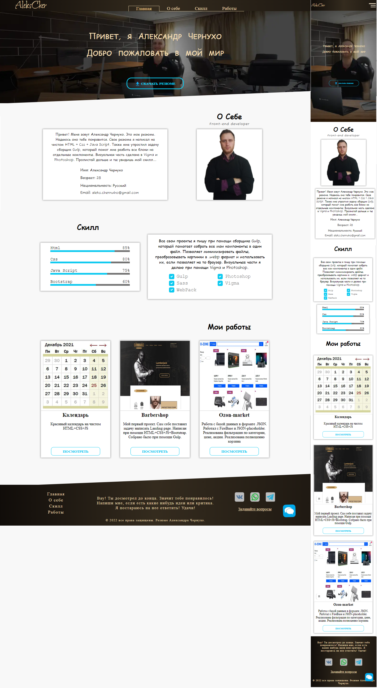

# Резюме Чернухо Александра
#### Данное резюме написано на HTML+CSS(SASS/SCSS)+Java-Script. Помогал собирать мне мои работы сборщик Gulp, Webpack. Примеры моих работ можно помсмотреть по ссылкам на мой GitHub:
* Барбершоп Landing:
https://github.com/AleksCher1993/BarbLanding

* ozon-market(работа с БД JSON)
https://github.com/AleksCher1993/ozon-extension

* work with table(работа с таблицей и с БД JSON через JSON-server)
https://github.com/AleksCher1993/work-with-table-and-db

* Swell maket - верстка по макету из Vigma + адаптивная верстка
https://github.com/AleksCher1993/swell

